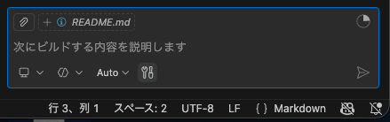
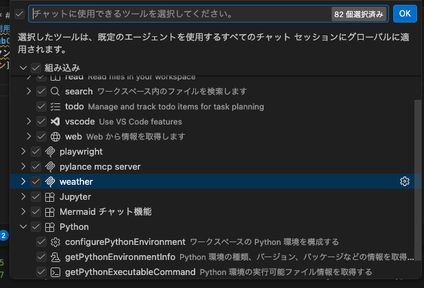
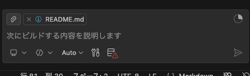
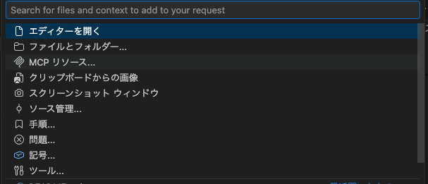
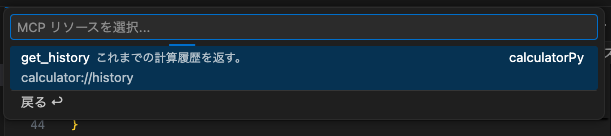
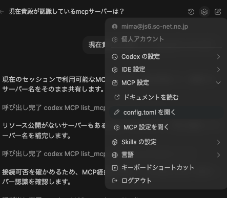
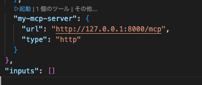
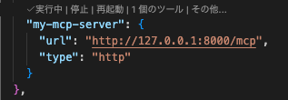
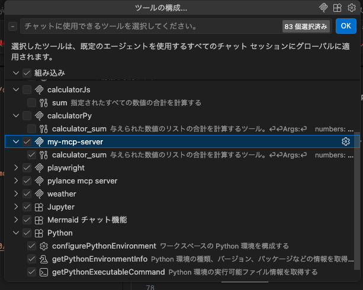

## MCP サーバーを利用する

### STDIOの場合

#### VSCode+GitHubCopilotのケース

1. `.vscode/mcp.json`を作成する。

```json
{
	"servers": {
    "weather": {
      "type": "stdio",
      "command": "uv",
      "args": [
        "--directory",
        "/Users/絶対パス/dev/mcp_sample/py",
        "run",
        "weather.py"
      ]
    }
	},
	"inputs": []
}
```

node.jsの場合は以下のようにカレントディレクトリを指定して実行する必要があります。

```json
{
	"servers": {
    "weather": {
      "type": "stdio",
      "command": "npm",
      "args": [
        "run",
        "dev",
        "--silent"
      ],
      "cwd": "/Users/絶対パス/dev/mcp_sample/js"
    }
	},
	"inputs": []
}
```

2. ツールの構成ボタンを押す


3. `.vscode/mcp.json`に書いたMCPサーバーが表示されるのでチェックする



リソースについては自前でMCPのリソースとして追加する必要がある




https://code.visualstudio.com/docs/copilot/customization/mcp-servers#_use-mcp-resources


#### VSCode+Codex OpenAIのケース

1. config.tomlを開く



2. 以下のように~/.codex/config.tomlにMCPサーバーの情報を記載する。

```
[mcp_servers.weather]
command = "uv"
args = ["--directory", "/Users/絶対パス/dev/mcp_sample/py", "run", "weather.py"]
```

なお、node.jsなどを使う場合は以下のとおり

```
[mcp_servers.calculate]
command = "npm"
args = ["--prefix", "/Users/絶対パス/dev/mcp_sample/js", "--silent", "run", "calculator_dev"]
```

3. 新しいチャットを開くと上記のMCPサーバーを認識する。


リソースについてはプロンプトに応じて自動で調べて使用する。

### HTTPの場合
#### VSCode+GitHubCopilotのケース
1.　以下のコマンドでmcpサーバーを起動しておく

```
uv run simple_http_server.py
```

2.  .vscode/mcp.json　を記載して起動を押す

```
# 略
		"my-mcp-server": {
			"url": "http://127.0.0.1:8000/mcp",
			"type": "http"
		}
# 略
```





3. ツールの構成ボタンでMCPサーバーを有効になっていることを確認する



### リソースの場合
#### VSCode+GitHubCopilotのケース

#### VSCode+Codex OpenAIのケース
ツールが使えている状態であれば

